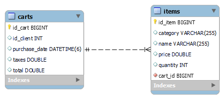

# Spring JPA OneToMany

Proyecto con implementación de la relacion One To Many para dos tablas ("Carritos" e "Items").

## Descripción

Para la realización de esta relación se debe usar la anotación @OneToMany y @ManyToOne propia de Spring JPA.

## Inicio

### Dependencias

* Spring v2.5.6, Spring JPA, MySQL driver, Java 8 (puede ser cualquier versión).
* Cualquier Sistema Operativo

### Instalación

* Clonar el repositorio
```
git clone https://github.com/Capdoo/spring-jpa-onetomany.git

```

* Crear la Base de Datos usando MySQL
```
CREATE DATABASE compras CHARACTER SET utf8 COLLATE utf8_general_ci;

```


### Editar las propiedades

* Es necesario modificar el archivo application.properties
* Se debe indicar el nombre de usuario y contraseña de la Base de Datos

```
spring.datasource.url=jdbc:mysql://localhost:3306/compras
spring.datasource.username=[Su username]
spring.datasource.password=[Su contraseña]
spring.datasource.driver-class-name=com.mysql.cj.jdbc.Driver

```

## Anotaciones
* One To Many Annotation (@OneToMany)
* Identificamos el modelo origen y usamos el parametro indicando el campo del modelo destino
```
@OneToMany(mappedBy="cart")
private Set<ItemModel> items;
```
* Many To One (@ManyToOne) y referencedColumnName con el origen id
* Identificamos el modelo destino y usamos la referencia al modelo origen
```
@ManyToOne
@JoinColumn(name="cart_id",referencedColumnName = "id_cart", nullable=false)
private CartModel cart;
```

## Relación


## Authors

Contribuidores y enlaces

. [@Capdoo](https://github.com/Capdoo)


## License

This project is licensed under the [NAME HERE] License - see the LICENSE.md file for details

## Acknowledgments

El fundamento de Spring JPA.
* [Spring One To Many - Baeldung](https://www.baeldung.com/hibernate-one-to-many)
